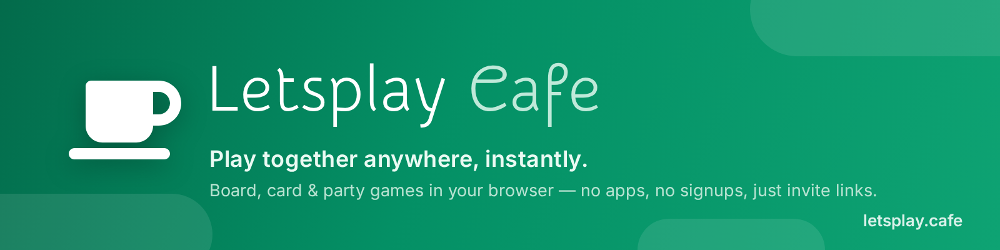
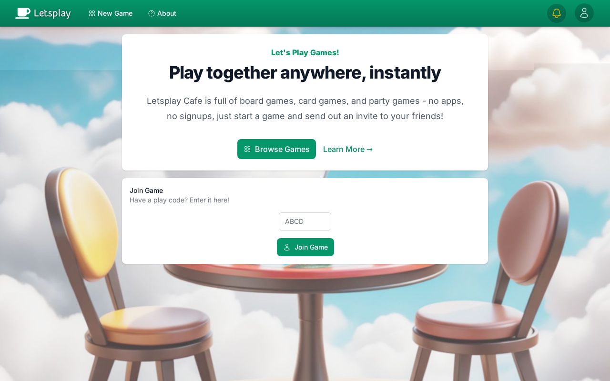
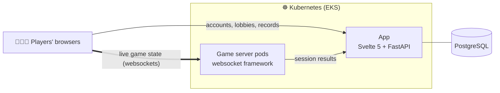

  

  <a href="https://letsplay.cafe"><b>▶&nbsp; Play now at letsplay.cafe</b></a>
  &nbsp;·&nbsp;
  <a href="https://letsplay.cafe/about">About</a>

---

**Letsplay Cafe** is home to tabletop and party games you can play digitally with any group of friends (or foes!). No apps, no downloads, no signups — start a game and send out invite links. It runs great on phones, tablets, PCs, and even Chromecast to a smart TV for that around-the-table feel.

  

## 🎲 The games

| | |
|---|---|
| **Peer Review** | A party card game that brings out the worst in everyone. Answer prompts, get judged, and find out who is the most horrible among you. |
| **Millenial Madness** | Be the first of your friends to own a house, or drink your sorrows away trying. A board game for up to 4 players! |

More games are always brewing ☕

## ⚙️ Under the hood

Letsplay is a real-time multiplayer platform built end-to-end in this org:

The app owns accounts, matchmaking, and game records; each live session runs on a game-server pod that syncs state to every player over websockets. Every branch gets its own auto-expiring preview environment of the full stack, and Playwright drives end-to-end browser tests of real multiplayer sessions in CI.

---

  Our repos are private — this page is the public face. Come play instead: <a href="https://letsplay.cafe"><b>letsplay.cafe</b></a> ☕

